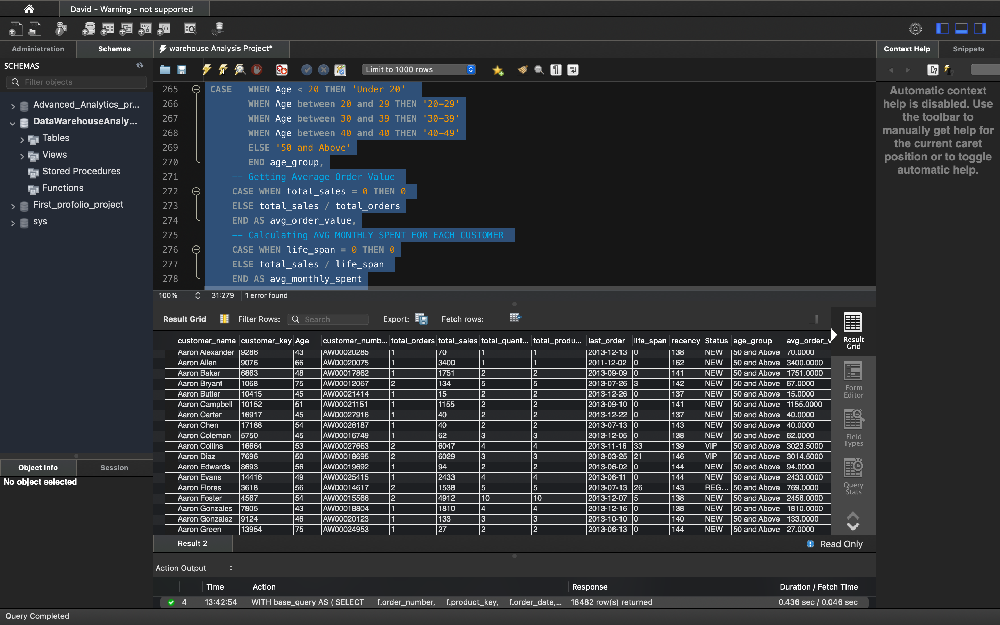

📊 Warehouse Customer & Product Analysis

Hi there! This project is a deep-dive analysis using SQL to generate actionable insights for a warehouse-based business dataset spanning 5 years.

I created two main reports from raw data using MySQL and visualized the findings with Tableau for dynamic exploration.

🧮 Datasets Used

Customers Table – Customer name, gender, location, age, etc.

Products Table – Product key, category, cost, product line

Sales Table – Order details, quantity, sales amount

📌 Report 1: Customer Metrics and Segmentation

🧠 Key Insights:

Customer segmentation into VIP, Regular, and New

Aggregated KPIs like total orders, total quantity, average monthly spend

Age segmentation and customer lifespan calculation

📄 SQL Snippet:

WITH base_query AS (
  SELECT
    f.order_number,
    f.product_key,
    f.order_date,
    f.sales_amount,
    f.quantity,
    c.customer_key,
    c.customer_number,
    CONCAT(c.first_name, ' ', c.last_name) AS customer_name,
    TIMESTAMPDIFF(YEAR, c.birthdate, CURRENT_DATE()) AS Age
  FROM fact_sales f
  LEFT JOIN dim_customers c ON c.customer_key = f.customer_key
  WHERE order_date IS NOT NULL
),
customer_aggregation AS (
  SELECT
    customer_name,
    customer_key,
    Age,
    customer_number,
    COUNT(DISTINCT order_number) AS total_orders,
    SUM(sales_amount) AS total_sales,
    SUM(quantity) AS total_quantity,
    COUNT(DISTINCT product_key) AS total_products,
    MAX(order_date) AS last_order,
    TIMESTAMPDIFF(MONTH, MIN(order_date), MAX(order_date)) AS life_span
  FROM base_query
  GROUP BY customer_name, customer_key, Age, customer_number
)
SELECT *,
  TIMESTAMPDIFF(MONTH, last_order, CURRENT_DATE()) AS recency,
  CASE
    WHEN life_span >= 12 AND total_sales > 5000 THEN 'VIP'
    WHEN life_span >= 12 THEN 'REGULAR'
    ELSE 'NEW'
  END AS Status,
  CASE
    WHEN Age < 20 THEN 'Under 20'
    WHEN Age BETWEEN 20 AND 29 THEN '20-29'
    WHEN Age BETWEEN 30 AND 39 THEN '30-39'
    WHEN Age = 40 THEN '40-49'
    ELSE '50 and Above'
  END AS age_group,
  CASE
    WHEN total_sales = 0 THEN 0
    ELSE total_sales / total_orders
  END AS avg_order_value,
  CASE
    WHEN life_span = 0 THEN 0
    ELSE total_sales / life_span
  END AS avg_monthly_spent
FROM customer_aggregation;

📸 Output Sample:

📌 Report 2: Product Performance & KPI Analysis

🧠 Key Insights:

Product segmentation based on sales revenue

Revenue-driven categorization: High Performers, Mid Range, Low Performers

KPIs such as average order revenue, monthly revenue, lifespan of products

📄 SQL Snippet:

SELECT
  p.product_id,
  f.order_date,
  p.category,
  p.subcategory,
  p.cost,
  p.product_line,
  f.customer_key,
  f.sales_amount,
  f.quantity,
  f.price,
  p.product_name,
  c.country,
  c.gender,
  CONCAT(c.first_name, ' ', c.last_name) AS Name
FROM dim_customers c
LEFT JOIN fact_sales f ON c.customer_key = f.customer_key
LEFT JOIN dim_products p ON p.product_key = f.product_key
WHERE order_date IS NOT NULL
  AND YEAR(order_date) = 2013
LIMIT 1000000;

📸 Output Sample:

📈 Final Visualization (Tableau)
[Tableau Dashboard](./Assets/Warehouse_Customer_Report.png)

[View it on Tableau Public](https://public.tableau.com/views/WarehouseCustomerReport/CustomerDashbaord?:language=en-US&publish=yes&:sid=&:redirect=auth&:display_count=n&:origin=viz_share_link)

[View it on Tableau Public](https://public.tableau.com/views/ProductsMetricsandBehaviour/Dashboard1?:language=en-US&:sid=&:redirect=auth&:display_count=n&:origin=viz_share_link)

Check the interactive Tableau dashboard that displays:

Year-over-year growth

Segment-wise breakdowns for customers and products

Quick KPIs for decision-makers

💡 To see the full dashboard and explore metrics interactively📌 Click here to view in my portfolio

